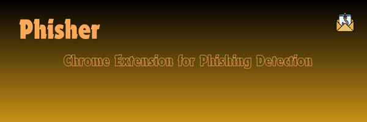

#Phisher

 <!-- Replace this with the actual path to your banner image -->
 <!-- Ensure the image path is correct -->

##  Overview

**Phisher** is a powerful Chrome extension designed to protect you from phishing attacks. Leveraging machine learning and VirusTotal integration, this extension provides real-time detection of phishing emails, ensuring your safety while receiving emails.

## Key Features

- **Real-time Detection**: Instantly identifies phishing emails.
- **VirusTotal Integration**: Checks URLs against VirusTotal's extensive database.
- **User-friendly**: Easy to install and use Chrome extension.
- **Open Source**: Contributions are welcome to improve the project.

## Installation

### Prerequisites

- Python 3.x
- Flask
- joblib
- Flask-CORS
- Chrome Browser

### Backend Setup

1. **Clone the repository**:
    ```bash
    git clone https://github.com/yourusername/phishing-email-detector.git
    cd phishing-email-detector/Backend
    ```

2. **Run the Flask server**:
    ```bash
    python app.py
    ```

### Chrome Extension Setup

1. **Load the extension in Chrome**:
    - Open Chrome and navigate to `chrome://extensions/`.
    - Enable "Developer mode" (top right corner).
    - Click "Load unpacked" and select the `chrome_extension` directory from this repository.

##  Usage

1. **Select an email** in Gmail.
2. **Select the email body and right-click it, then select 'analyze email for phishing'** in the menu bar.
3. **View the detection result**: The extension will analyze the email and show if it's safe or phishing. It will also check any URLs in the email against VirusTotal.

##  Configuration

- **VirusTotal API Key**: Ensure you have your VirusTotal API key set in the `app.py` file.
  ```python
  VIRUSTOTAL_API_KEY = 'your_api_key_here'

## Dataset
The model is trained on a dataset of phishing and legitimate emails. If you want to update or change the dataset:

1. Download a new dataset from sources like Kaggle.
2. Update the training script with the new dataset paths.
3. Retrain the model and save the new phishing_model.pkl and vectorizer.pkl.
